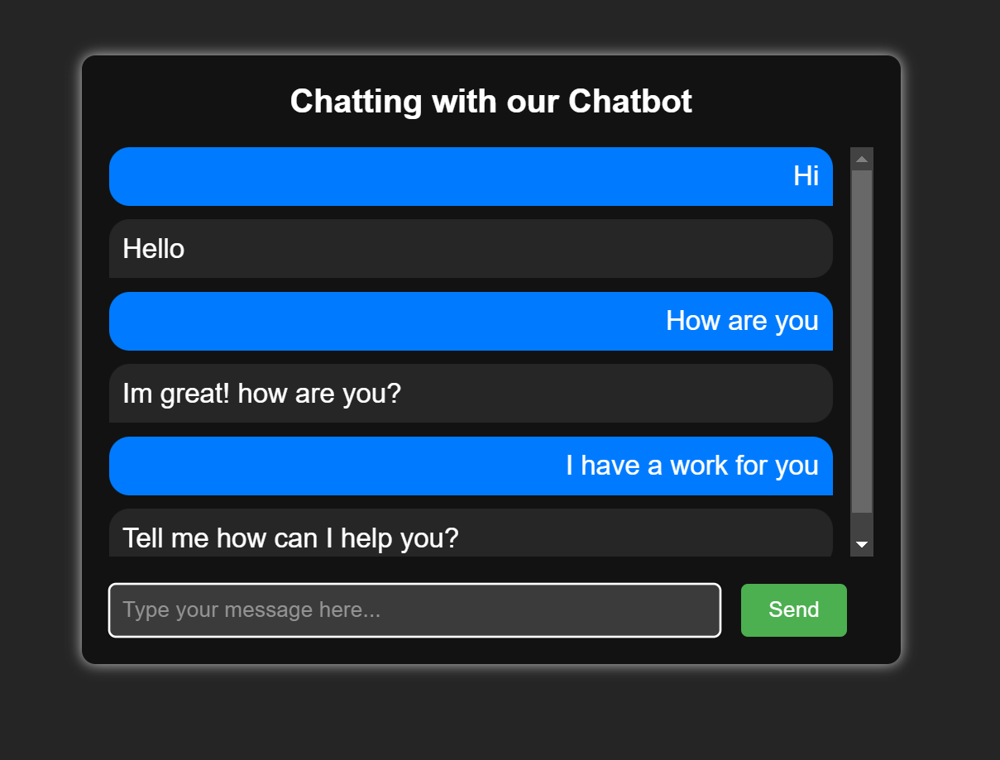

# Chatbot Application

This is a chatbot application developed using machine learning and deep learning techniques, with the help of Python's `nltk`, `tensorflow`, and `keras` libraries. The frontend of the application is built using HTML and Flask, and it allows the user to interact with the chatbot through a web interface.

## Installation

To install and run the application, follow these steps:

1. Clone the repository to your local machine
2. Install the required dependencies by running `pip install -r requirements.txt`
3. Run the Flask app by running `python app.py`

## Dataset

The dataset used for training the chatbot contains 4000 lines of conversations with different topics and styles to ensure the model's robustness in handling various inputs.

## Model

- The model is built using GRU (Gated Recurrent Unit) neural network architecture, which is known for its effectiveness in processing sequential data and maintaining long-term dependencies.
- To process natural language and understand user intent, the chatbot utilizes NLTK (Natural Language Toolkit) library, which provides various tools for text preprocessing, tokenization, and sentiment analysis.
- For model training and optimization, TensorFlow and Keras libraries are used, which offer a high-level API for building and tuning deep learning models.

## Usage

Once the Flask app is running, open your web browser and navigate to `http://localhost:5000` to access the chatbot. You can enter text messages into the chat window and the chatbot will respond with a relevant message.

## Limitations

This chatbot application has been trained on a specific set of data and may not be able to understand all types of user queries. Additionally, the chatbot may not always provide accurate responses and may require additional training to improve its accuracy.

## Future work

Future work for the chatbot application includes improving the model's accuracy and expanding its capabilities by adding more training data, integrating with external APIs for accessing additional information sources, and incorporating more advanced natural language processing techniques, such as named entity recognition and topic modeling.